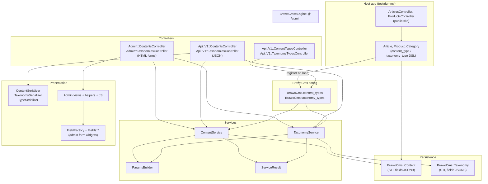
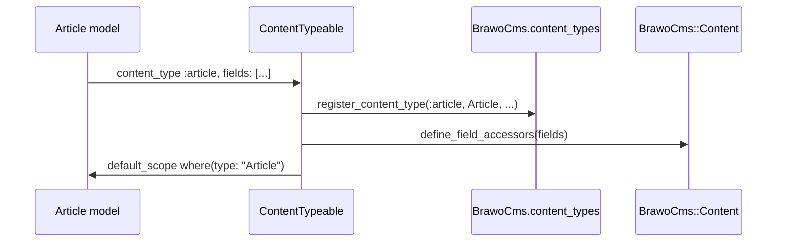
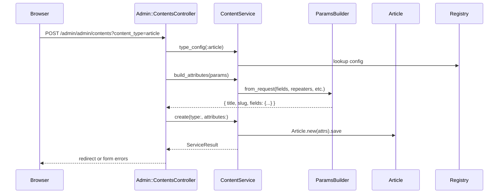

# BrawoCMS Architecture

Rails engine mounted at `/admin`. Host app defines content types (`Article`, `Product`) and taxonomies (`Category`). Engine provides admin UI + JSON API. Shared service layer sits between controllers and models.

## Big picture



## Layer responsibilities

| Layer | Where | Does what |
|---|---|---|
| **Config registry** | `lib/brawo_cms.rb` | Global map of registered types → model class, field defs, labels |
| **Host models** | e.g. `Article`, `Category` | Declare type via `content_type` / `taxonomy_type`; auto-register + define accessors |
| **Base models** | `BrawoCms::Content`, `BrawoCms::Taxonomy` | STI on shared tables; core cols (`title`, `slug`, `status`); custom fields in `fields` JSONB |
| **Concerns** | `ContentTypeable`, `TaxonomyTypeable` | Wire model → registry; `default_scope` by `type`; dynamic field accessors |
| **Field system** | `FieldFactory`, `Fields::*` | Turn field defs into admin inputs (text, taxonomy picker, repeater, etc.) |
| **Services** | `ContentService`, `TaxonomyService` | CRUD logic; lookup type config; return `ServiceResult` |
| **ParamsBuilder** | `app/services/brawo_cms/params_builder.rb` | Normalize request params → `{ title:, slug:, fields: {...} }`; handles repeaters |
| **ServiceResult** | `app/services/brawo_cms/service_result.rb` | Uniform success/failure envelope for controllers |
| **Admin controllers** | `Admin::ContentsController` etc. | HTTP/HTML; call services; redirect or re-render forms |
| **API controllers** | `Api::V1::*` | HTTP/JSON; bearer token auth; call same services |
| **Serializers** | `ContentSerializer`, etc. | Shape records → JSON for API only |
| **Public controllers** | host app | Read published content for frontend; bypass engine services |

## Content type registration flow



One table `brawo_cms_contents`, many STI subclasses. Type picked by `?content_type=article` (admin/API) or model class directly (public site).

## Create request flow (admin)



API create path is identical through services — difference is JSON in/out via serializers instead of ERB views.

## Content vs taxonomy — parallel stacks

| | Content | Taxonomy |
|---|---|---|
| Base model | `BrawoCms::Content` | `BrawoCms::Taxonomy` |
| Concern | `ContentTypeable` | `TaxonomyTypeable` |
| Service | `ContentService` | `TaxonomyService` |
| Admin | `Admin::ContentsController` | `Admin::TaxonomiesController` |
| API | `Api::V1::ContentsController` | `Api::V1::TaxonomiesController` |
| Schema API | `ContentTypesController` | `TaxonomyTypesController` |
| Serializer | `ContentSerializer` | `TaxonomySerializer` |

Same pattern both sides. Intentional symmetry.

## Field storage model

```
brawo_cms_contents
├── id, type (STI), title, slug, description, status, published_at  ← columns
└── fields (jsonb)  ← custom per-type fields (author, body, faq_items, ...)
```

Base attrs = table columns. Custom attrs = `fields` hash. `ParamsBuilder` splits incoming params accordingly. `FieldFactory` renders the admin form from type config.

## Routes (mental model)

```
Host app
  /articles          → public Article pages
  /admin             → engine mount point

Engine (under /admin)
  /admin/admin/contents?content_type=article   → admin CRUD
  /admin/api/v1/contents?content_type=article  → JSON API
  /admin/api/v1/content_types                  → schema introspection
```

Double `/admin/admin` = mount prefix + engine `namespace :admin`. Expected.

## Design intent

- **Models** — data + type-specific behavior
- **Registry** — runtime type catalog
- **Fields** — admin UI only
- **Services** — business logic shared by admin + API
- **ParamsBuilder** — param parsing (messiest part, esp. repeaters)
- **Controllers** — thin HTTP adapters
- **Serializers** — API response shape only
